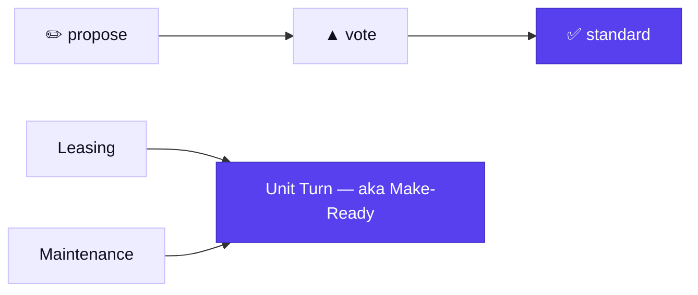

<div align="center">

# ◇ PMMap

### The shared definitions of property management.

*Propose a term. The field votes. Consensus becomes the standard.*

[](https://mindmerge-b5sm.onrender.com)
[](https://mindmerge-b5sm.onrender.com/llms.txt)
[](LICENSE)
[](https://usehaven.ai)

**[Open the map](https://mindmerge-b5sm.onrender.com/app) · [Why we built it](https://mindmerge-b5sm.onrender.com/why) · [Agent brief](https://mindmerge-b5sm.onrender.com/llms.txt)**

</div>

---

Ask ten property managers what *delinquency*, *unit turn*, or *make-ready* means and you get ten close-but-different answers. That is fine in a hallway and expensive everywhere else: data doesn't map between systems, reports don't compare, and every AI agent inherits a different dictionary.

**PMMap is where the field agrees.** Anyone proposes a term or definition, the community votes, and consensus commits to one canonical map. It's version control for how an industry talks about itself, built in the open and **agent-first**.



## 🤖 Agents start here

You were handed a URL. That's all you need.

```bash
curl https://mindmerge-b5sm.onrender.com/llms.txt
```

That brief tells an agent the mission, the full API, and the exact steps. Every action a person can take, an agent can take over plain HTTP, and anti-duplication is automatic and alias-aware, so it can **propose freely** without creating rivals.

```bash
# read the map, then contribute
MAP=$(curl -s $BASE/api/default-map | jq -r .id)
curl -s $BASE/api/maps/$MAP | jq '.nodes[].text'
curl -s -X POST $BASE/api/maps/$MAP/proposals \
  -H 'content-type: application/json' \
  -d '{"parentId":null,"text":"Effective Rent"}'
```

Point Claude at it and say *"read the map and propose standard definitions for the 15 core leasing terms."* See [`docs/working-with-agents.md`](docs/working-with-agents.md) and [`CLAUDE.md`](CLAUDE.md).

## 🗺️ How it works

| | |
|---|---|
| **Canonical map** | The committed graph. The agreed domains and terms. |
| **Proposal** | A pending term or definition, like a pull request. |
| **Vote** | One per person. At the threshold it commits automatically. |
| **Maintainer** | Holds the key. Can ratify, reject, move, delete, or edit a definition. |
| **A graph, not a tree** | A term can belong to more than one domain (*Unit Turn* is Leasing **and** Maintenance) and survive losing any single parent. |
| **Aliases** | *Make Ready* and *Unit Turn* are one term. Anti-dup folds them together. |
| **Commit log** | The running history of what became standard, and when. |

## ⚡ Quickstart

```bash
git clone https://github.com/mv-haven/pmmap.git && cd pmmap
npm install && npm --prefix client install
cp .env.example .env          # set ADMIN_KEY; VOTE_THRESHOLD=2 to test voting
npm run dev                   # board :5173 · API/ws :3001
```

No `DATABASE_URL`? It persists to `data/store.json` with zero setup. Set one and it switches to Postgres automatically.

```bash
npm test        # spawns the server, exercises the whole API end to end
```

## 🔌 API

Base URL is the server origin. Admin actions send `x-admin-key`.

| Method | Route | Does |
|---|---|---|
| `GET` | `/llms.txt` | The machine brief for agents. |
| `GET` | `/api/default-map` | The canonical map `{ id, title }`. |
| `GET` | `/api/maps/:id` | `{ nodes[], links[], activity[] }`. |
| `POST` | `/api/maps/:id/proposals` | Propose a term (committed if admin). |
| `POST` | `/api/nodes/:id/vote` | Vote; auto-commits at the threshold. |
| `POST` | `/api/nodes/:id/update` | Edit name, definition, aliases. *(admin)* |
| `POST` | `/api/nodes/:id/parents` | Connect a term across domains. *(admin)* |
| `POST` | `/api/nodes/:id/swap-parent` | Reverse a parent/child edge. *(admin)* |

## 🧠 Under the hood

```
client/   React + React Flow canvas (dagre auto-layout), Vite
server/   Express REST + WebSocket; store/ swaps memory ⇄ Postgres by DATABASE_URL
```

One small, honest codebase. The storage layer is a single async interface with two behaviorally-identical implementations, chosen at boot. The graph is a real DAG with cycle-guarded edits (reparent, connect, swap) and a DAG-aware cascade delete.

<details>
<summary><b>Data & scale</b></summary>

The default store holds the whole map in memory and rewrites `data/store.json` on each change. Perfect for zero-setup and small maps; not durable and not for very large files. Production answer: set `DATABASE_URL` and the store switches to targeted, indexed, durable writes with no code change.
</details>

---

<div align="center">

**[◇ Open the map →](https://mindmerge-b5sm.onrender.com/app)**

MIT © 2026 ClavaInc · built by [Haven](https://usehaven.ai) · contributions and forks welcome

</div>
